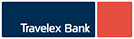

# Landing Page Nexo Câmbio

Landing page one-page da Nexo Câmbio, baseada no visual e nas animações do site de referência (azul-marinho `#081F61` + dourado `#C4942D`).

## Estrutura

- **[index.html](index.html)** — página principal (abra direto no navegador).
- **[prototipos.html](prototipos.html)** — seletor dos três protótipos anteriores em [layouts/](layouts/) (institucional, fintech, editorial).
- **assets/** — logos, imagens e favicon. Logos dos bancos parceiros vão em `assets/bancos/`.

## Destaques

- **Cotações ao vivo fixas no topo**: dólar e euro em reais, com variação do dia, atualizadas a cada 30 s (AwesomeAPI; reserva: Frankfurter/BCE). A barra permanece visível durante todo o scroll.
- **Animações de scroll** com AOS (`fade-up`, `fade-right`, `fade-left`, `zoom-in`), rolagem suave com easing nos links âncora, navbar que encolhe ao rolar e contadores animados na faixa dourada.
- Respeita `prefers-reduced-motion`.

## Bancos parceiros

A seção **Parceiros** tem 8 espaços reservados: Travelex, Moneycorp, Oz Corretora, Freex Corretora, Topázio, Sttart, Mercado Bitcoin e Bloquo. Para colocar um logo, salve o arquivo em `assets/bancos/` e adicione um `` dentro do `.partner-slot` correspondente (o ícone cinza some sozinho):

```html
<div class="partner-slot"><i data-lucide="landmark"></i></div>
```

## Tecnologia

HTML/CSS/JS puros. Dependências via CDN: AOS 2.3.1 e Lucide 0.469.0 (a página continua legível se elas não carregarem).
